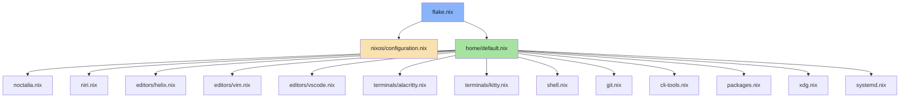

# Project Structure Visualization

## Complete Directory Tree

```
nix_river/
│
├── 📋 Documentation
│   ├── README.md                    # Main usage guide
│   ├── SETUP_GUIDE.md              # Installation instructions (original)
│   ├── MIGRATION.md                # Migration details & breaking changes
│   ├── CHECKLIST.md                # Pre-deploy checklist
│   ├── SUMMARY.md                  # What was done
│   └── PROJECT_STRUCTURE.md        # This file
│
├── ⚙️ Flake Configuration
│   ├── flake.nix                   # Main flake (NixOS 25.11)
│   ├── flake.lock                  # Locked dependencies
│   └── .gitignore                  # Git ignore rules
│
├── 🖥️ System Configuration (nixos/)
│   ├── configuration.nix           # System config (kernel, services, users)
│   ├── hardware-configuration.nix.example  # Hardware config template
│   └── IMPORTANT.md                # ⚠️ Hardware config instructions
│
└── 🏠 Home Manager (home/)
    ├── default.nix                 # Main imports hub
    │
    ├── 🎨 Desktop Environment
    │   ├── noctalia.nix           # Noctalia shell (bar, widgets)
    │   └── niri.nix               # Niri compositor (keybindings, layout)
    │
    ├── ✏️ Editors (editors/)
    │   ├── helix.nix              # Helix (main editor)
    │   ├── vim.nix                # Vim
    │   └── vscode.nix             # VSCode
    │
    ├── 💻 Terminals (terminals/)
    │   ├── alacritty.nix          # Alacritty (default)
    │   └── kitty.nix              # Kitty
    │
    ├── 🛠️ Development Tools
    │   ├── shell.nix              # Bash + Starship prompt
    │   ├── git.nix                # Git + Delta + LazyGit
    │   ├── cli-tools.nix          # direnv, zoxide, fzf, bat, htop
    │   └── packages.nix           # All dev packages (Go, Python, Node, etc)
    │
    └── 🔧 System Integration
        ├── xdg.nix                # XDG directories
        └── systemd.nix            # User services & activation
```

## Module Dependencies



## File Sizes & Line Counts

| File | Lines | Category |
|------|-------|----------|
| `home/niri.nix` | ~220 | Compositor config |
| `home/packages.nix` | ~120 | Package list |
| `home/shell.nix` | ~60 | Shell config |
| `home/editors/helix.nix` | ~50 | Editor config |
| `home/default.nix` | ~40 | Main imports |
| `home/noctalia.nix` | ~35 | Desktop shell |
| `home/git.nix` | ~30 | Git config |
| `home/cli-tools.nix` | ~30 | CLI tools |
| `home/terminals/alacritty.nix` | ~30 | Terminal config |
| `home/terminals/kitty.nix` | ~25 | Terminal config |
| `home/xdg.nix` | ~25 | XDG dirs |
| `home/systemd.nix` | ~10 | User services |
| `home/editors/vim.nix` | ~5 | Editor config |
| `home/editors/vscode.nix` | ~10 | Editor config |
| **Total home/** | ~690 | All home configs |

## Configuration Flow

```
User Action
    ↓
nixos-rebuild switch --flake .#nixos
    ↓
Reads flake.nix
    ↓
    ├→ System: nixos/configuration.nix
    │     ├→ Boot, kernel, networking
    │     ├→ Nix settings, Docker
    │     ├→ Fonts, services
    │     └→ User accounts
    │
    └→ Home: home/default.nix
          ├→ Desktop: noctalia.nix, niri.nix
          ├→ Editors: helix.nix, vim.nix, vscode.nix
          ├→ Terminals: alacritty.nix, kitty.nix
          ├→ Shell: shell.nix, git.nix, cli-tools.nix
          ├→ Apps: packages.nix
          └→ System: xdg.nix, systemd.nix
```

## Quick Navigation

### Want to change...

| What | Edit This File |
|------|----------------|
| Keybindings | `home/niri.nix` |
| Bar/widgets | `home/noctalia.nix` |
| Editor settings | `home/editors/helix.nix` |
| Terminal theme | `home/terminals/alacritty.nix` |
| Shell aliases | `home/shell.nix` |
| Git config | `home/git.nix` |
| Add packages | `home/packages.nix` |
| System services | `nixos/configuration.nix` |
| Boot settings | `nixos/configuration.nix` |
| Network settings | `nixos/configuration.nix` |

### Want to enable/disable...

| What | Do This |
|------|---------|
| VSCode | Comment/uncomment in `home/default.nix` |
| Kitty terminal | Comment/uncomment in `home/default.nix` |
| Any module | Comment/uncomment its import |

## Inputs (from flake.nix)

- **nixpkgs**: `github:nixos/nixpkgs/nixos-25.11` (NixOS stable)
- **home-manager**: `github:nix-community/home-manager` (follows nixpkgs)
- **niri**: `github:sodiboo/niri-flake` (Niri compositor)
- **noctalia**: `github:noctalia-dev/noctalia-shell` (Desktop shell)

## Outputs

- `nixosConfigurations.nixos`: Main NixOS system configuration
  - System: `x86_64-linux`
  - User: `river`
  - Desktop: Niri + Noctalia

---

**Structure Created**: 2026-02-05  
**NixOS Version**: 25.11  
**Total Files**: 14 home modules + 1 system config + 6 docs
